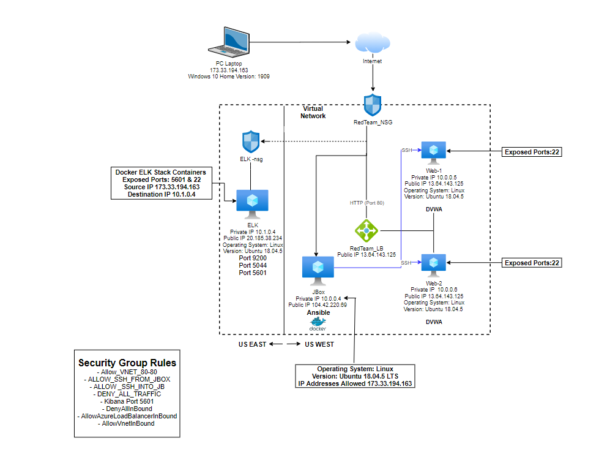

# Project-1
## Automated ELK Stack Deployment

The files in this repository were used to configure the network depicted below.

These files have been tested and used to generate a live ELK deployment on Azure. They can be used to either recreate the entire deployment pictured above. Alternatively, select portions of the _filebeat-playbook.yml____ file may be used to install only certain pieces of it, such as Filebeat.

  -[filebeat-playbook.yml](Ansible/filebeat-playbook.yml)

This document contains the following details:
- Description of the Topology
- Access Policies
- ELK Configuration
  - Beats in Use
  - Machines Being Monitored
- How to Use the Ansible Build

### Description of the Topology

The main purpose of this network is to expose a load-balanced and monitored instance of DVWA, the D*mn Vulnerable Web Application.

Load balancing ensures that the application will be highly available and reliable, in addition to restricting _access___ to the network.
- What aspect of security do load balancers protect? Load Balancers assist in distributing traffic steadily between the servers and reduces  Denial-of-service (DoS) attacks 

What is the advantage of a jump box?
The jump box controls entry to other virtual machines by authorizing connections from set IP addresses and being redirected to the other machines. 

Integrating an ELK server allows users to easily monitor the vulnerable VMs for changes to the __logs___ and system _files____.
-  What does Filebeat watch for?_Filebeat assists in creating and sorting log files to send off to Logstash and Elasticsearch. As well, as it records data regarding the file process, which includes when the files have been adjusted and which specific files.  
-  TODO: What does Metricbeat record?_Metricbeat is a lightweight shipper that is installed on a server to regularly gather metrics from an operating system as well as from services that are working on a host machine.  

The configuration details of each machine may be found below.
_Note: Use the [Markdown Table Generator](http://www.tablesgenerator.com/markdown_tables) to add/remove values from the table_.

| Name     | Function | IP Address | Operating System |
|----------|----------|------------|------------------|
| Jbox     | Gateway  | 10.0.0.1   | Linux Ubuntu 18.04.5           |
| Web-1    | Webserver| 10.0.0.5   | Linux Ubuntu 18.04.5           |
| Web-2    | Webserver| 10.0.0.6   | Linux Ubuntu 18.04.5           |
| ELK      |Monitoring| 10.1.0.4   | Linux Ubuntu 18.04.5           |

### Access Policies

The machines on the internal network are not exposed to the public Internet. 

Only the _Jbox____ machine can accept connections from the Internet. Access to this machine is only allowed from the following IP addresses:
- _TODO: Add whitelisted IP addresses_ 173.33.194.163 

Machines within the network can only be accessed by _Jbox IP 10.0.0.4____.
- _TODO: Which machine did you allow to access your ELK VM? Jbox Virtual Machine  What was its IP address?_10.0.0.4

A summary of the access policies in place can be found in the table below.

| Name     | Publicly Accessible | Allowed IP Addresses |
|----------|---------------------|----------------------|
| Jbox     | Yes                 | 173.33.194.163       |
| Web-1    | No                  | 10.0.0.4             |
| Web-2    | No                  | 10.0.0.4             |
| ELK      | No                  | 173.33.194.163       |

### Elk Configuration

Ansible was used to automate configuration of the ELK machine. No configuration was performed manually, which is advantageous because...
- _TODO: What is the main advantage of automating configuration with Ansible?_ it makes sure the scripts will run identically on every virtual machine and the automated configurations will do the same thing each time they are ran, reducing variability among the configuration process. 

The playbook implements the following tasks:
- _TODO: In 3-5 bullets, explain the steps of the ELK installation play. E.g., install Docker; download image; etc._
- Install docker.io
- Install python3-pip
- Install docker module 
- Increase virtual memory and Use more memory
- Download and launch a docker elk container with published ports: 5601, 9200, 5044

The following screenshot displays the result of running `docker ps` after successfully configuring the ELK instance.

### Target Machines & Beats
This ELK server is configured to monitor the following machines:
- _TODO: List the IP addresses of the machines you are monitoring_ Web-1 Private IP Address 10.0.0.5 and Web-2 Private IP Address 10.0.0.6 

We have installed the following Beats on these machines:
- Filebeat (filebeat-7.4.0-amd64.deb) 
- Metricbeat (metricbeat-7.4.0-amd64.deb)

These Beats allow us to collect the following information from each machine:
- _TODO: In 1-2 sentences, explain what kind of data each beat collects, and provide 1 example of what you expect to see. E.g., `Winlogbeat` collects Windows logs, which we use to track user logon events, etc._
- Filebeat collects log files, which will track the Apache server and MySQL database logs that are created by DVWA. The data visualization will be observed in Kibana. 
- Metricbeat assists in montitoring servers and services that are hosted by gathering metrics from operating systems and several services. The Data visualization monitoring and metric analyzation will then be observed through kibana. 
### Using the Playbook
In order to use the playbook, you will need to have an Ansible control node already configured. Assuming you have such a control node provisioned: 

SSH into the control node and follow the steps below:
- Copy the _filebeat-config.yml____ file to __ansible container /etc/ansible/files/filebeat-config.yml___.
- Update the _hosts____ file to include...the elk server 10.1.0.4 under the webservers_
- Run the playbook, and navigate to http://20.185.38.234:5601/app/kibana go to Step 5:Module Status and click Check Data __ to check that the installation worked as expected.

_TODO: Answer the following questions to fill in the blanks:_
- _Which file is the playbook? filebeat-playbook.yml  Where do you copy it?_ /etc/ansible/roles 
- _Which file do you update to make Ansible run the playbook on a specific machine? the hosts file How do I specify which machine to install the ELK server on versus which to install Filebeat on?_add the private IP of the elk virtual machine under webservers 
- _Which URL do you navigate to in order to check that the ELK server is running? http://20.185.38.234:5601/app/kibana

_As a **Bonus**, provide the specific commands the user will need to run to download the playbook, update the files, etc._

- Run ansible-playbook filebeat-playbook.yml to download the playbook 
- Run sudo apt-get update to update the files 

