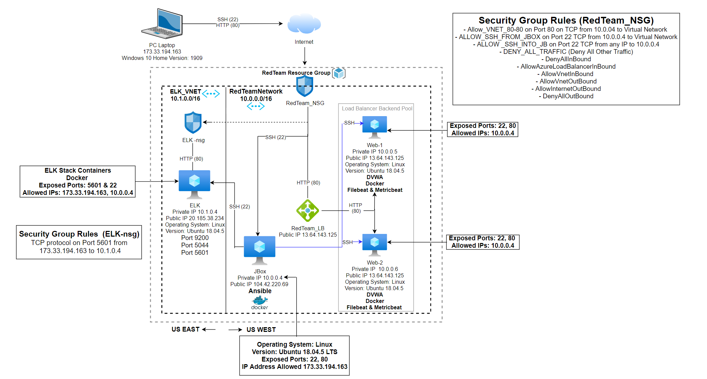

# Project-1
## Automated ELK Stack Deployment

The files in this repository were used to configure the network depicted below.

These files have been tested and used to generate a live ELK deployment on Azure. They can be used to either recreate the entire deployment pictured above. Alternatively, select portions of the .yml file may be used to install only certain pieces of it, such as Filebeat.

  -[ELK](Ansible/install-elk.yml)                                                         
  -[DVWA](Ansible/dvwa.yml)                                        
  -[Filebeat](Ansible/filebeat-playbook.yml)                                                
  -[Metricbeat](Ansible/metricbeat-playbook.yml)                          

This document contains the following details:
- Description of the Topology
- Access Policies
- ELK Configuration
  - Beats in Use
  - Machines Being Monitored
- How to Use the Ansible Build

### Description of the Topology

The main purpose of this network is to expose a load-balanced and monitored instance of DVWA, the D*mn Vulnerable Web Application.

Load balancing ensures that the application will be highly available and reliable, in addition to restricting access to the network.
- What aspect of security do load balancers protect? Load Balancers assist in distributing traffic steadily between the servers and reduces  Denial-of-service (DoS) attacks 

What is the advantage of a jump box?
The jump box controls entry to other virtual machines by authorizing connections from set IP addresses and being redirected to the other machines. 

Integrating an ELK server allows users to easily monitor the vulnerable VMs for changes to the network logs and system files.
-  What does Filebeat watch for? Filebeat assists in creating and sorting log files to send off to Logstash and Elasticsearch. As well, as it records data regarding the file process, which includes when the files have been adjusted and which specific files.  
-  What does Metricbeat record? Metricbeat is a lightweight shipper that is installed on a server to regularly gather metrics from an operating system as well as from services that are working on a host machine.  

The configuration details of each machine may be found below.
_Note: Use the [Markdown Table Generator](http://www.tablesgenerator.com/markdown_tables) to add/remove values from the table_.

| Name     | Function | IP Address | Operating System |
|----------|----------|------------|------------------|
| Jbox     | Gateway  | 10.0.0.1   | Linux Ubuntu 18.04.5           |
| Web-1    | Webserver| 10.0.0.5   | Linux Ubuntu 18.04.5           |
| Web-2    | Webserver| 10.0.0.6   | Linux Ubuntu 18.04.5           |
| ELK      |Monitoring| 10.1.0.4   | Linux Ubuntu 18.04.5           |

### Access Policies

The machines on the internal network are not exposed to the public Internet. 

Only the Jump Box machine can accept connections from the Internet. Access to this machine is only allowed from the following IP addresses:
- Home IP Address 173.33.194.163 

Machines within the network can only be accessed by Jump Box.
- Which machine did you allow to access your ELK VM? Jump Box Virtual Machine 
- What was its IP address? Private IP:10.0.0.4.

A summary of the access policies in place can be found in the table below.

| Name     | Publicly Accessible | Allowed IP Addresses |
|----------|---------------------|----------------------|
| Jbox     | Yes                 | 173.33.194.163       |
| Web-1    | No                  | 10.0.0.4             |
| Web-2    | No                  | 10.0.0.4             |
| Load Balancer | Yes            | 173.33.194.163       |
| ELK      | Yes                  | 10.0.0.4/173.33.194.163|

### Elk Configuration

Ansible was used to automate configuration of the ELK machine. No configuration was performed manually, which is advantageous because...
- What is the main advantage of automating configuration with Ansible? It makes sure the scripts will run identically on every virtual machine and the automated configurations will do the same thing each time they are ran, reducing variability among the configuration process. 

The playbook implements the following tasks:
- Install Docker.io
- Install Python3-pip
- Install Docker Module 
- Increase Virtual Memory and Use More Memory
- Download and launch a docker elk container with published ports: 5601, 9200, 5044

The following screenshot displays the result of running `docker ps` after successfully configuring the ELK instance.

### Target Machines & Beats
This ELK server is configured to monitor the following machines:
- Web-1 Private IP Address 10.0.0.5 
- Web-2 Private IP Address 10.0.0.6 

We have installed the following Beats on these machines:
- Filebeat (filebeat-7.4.0-amd64.deb) 
- Metricbeat (metricbeat-7.4.0-amd64.deb)

These Beats allow us to collect the following information from each machine:
- Filebeat collects log files, which will track the Apache server and MySQL database logs that are created by DVWA, which can be used to monitor attempted logon requests and visitors. The data visualization will be observed in Kibana. 
- Metricbeat assists in montitoring servers and services that are hosted by gathering metrics from operating systems and several services. Metricbeat observes system-level CPU usage, and memory usage. The Data visualization monitoring and metric analyzation will then be observed through kibana. 
### Using the Playbook
In order to use the playbook, you will need to have an Ansible control node already configured. Assuming you have such a control node provisioned: 

SSH into the control node and follow the steps below:
- Copy the filebeat-config.yml file to ansible container /etc/ansible/files/filebeat-config.yml.
- Update the filebeat-config.yml file to include...
   - At line #1106:
    - output.elasticsearch:
    - hosts: ["10.1.0.4:9200"]
    - username: "elastic"
    - password: "changeme"
   - At line #1806:
    - setup:kibana:
    - host: "10.1.0.4:5601"

- Run the playbook, and navigate to kibana using the ELK-VM Public IP Address to check that the installation worked as expected.
  - Navigate to Kibana through http://20.185.38.234:5601/app/kibana (http://[your.VM.IP]:5601/app/kibana)
  - Click "Add Log Data"
  - Select "System Logs"
  - Click on the DEB tab under "Getting Started"
  - Scroll to the "Step 5: Module Status 
  - Click "Check Data" at the bottom of the page 

 The Following will be shown if the installation was successful

- Copy the metricbeat-config.yml file to ansible container /etc/ansible/files/metricbeat-config.yml.                        - Update the filebeat-config.yml file to include...
   - At line #93:
    - output.elasticsearch:
    - hosts: ["10.1.0.4:9200"]                                         
    - username: "elastic"
    - password: "changeme"
   - At line #61:
    - setup:kibana:
    - host: "10.1.0.4:5601"

- Run the playbook, and navigate to kibana using the ELK-VM Public IP Address to check that the installation worked as expected. 
  - Navigate to Kibana through http://20.185.38.234:5601/app/kibana (http://[your.VM.IP]:5601/app/kibana)
  - Click "Add Log Data"
  - Select "System Logs"
  - Click on the DEB tab under "Getting Started"
  - Scroll to the "Step 5: Module Status
  - Click "Check Data" at the bottom of the page

 The Following will be shown if the installation was successful

Answer the following questions to fill in the blanks:
- Which file is the playbook? Where do you copy it?
  - Playbook Files: filebeat-playbook.yml, metricbeat-playbook.yml , dvwa.yml, and install-elk.yml  
  - filebeat-playbook.yml and metricbeat-playbook.yml are in /etc/ansible/roles directory and dvwa.yml, and install-elk.yml are in /etc/ansible directory
  - Configuration files (filebeat-config.yml and metricbeat-config.yml) are copied to Web-1 and Web-2 Virtual machine's in /etc/filebeat directory (called         filebeat.reference.yml) and /etc/metricbeat directory (called metricbeat.reference.yml)
- Which file do you update to make Ansible run the playbook on a specific machine? 
    - The hosts file using the specific IP address of the Virtual Machine in /etc/ansible/hosts directory (as seen below two groups should be outlined [webservers] and [elk] 
- How do I specify which machine to install the ELK server on versus which to install Filebeat on?    
   - Update the hosts file in /etc/ansible/hosts Add the private IP of the ELK virtual machine which is 10.1.0.4 in the [elk] group under the [webservers] group which will install the ELK server and the other group [webservers] which has the IP addresses of Web-1 10.0.0.5 and Web-2 10.0.0.6 which included the IP addresses of the Virtual Machines which will Install Filebeat and Metricbeat.   
 
  In the Hosts file the following edits were made:
    - Line #20 was updated to include Web-1 and Web-2 Virtual Machine's Private IP Addresses under the [webservers] group (as follows)                 
     - **[webservers]**                                                                                                                          
10.0.0.5 ansible_python_interpreter=/usr/bin/python3                                                        
10.0.0.6 ansible_python_interpreter=/usr/bin/python3                                          
   - Line #28 was updated to include the ELK Virtual Machine Private IP Address under the [elk] group (as follows)                       
     - **[elk]**                                                                                                              
10.1.0.4 ansible_python_interpreter=/usr/bin/python3                               

- Which URL do you navigate to in order to check that the ELK server is running? http://20.185.38.234:5601/app/kibana (http://[your.VM.IP]:5601/app/kibana)

As a **Bonus**, provide the specific commands the user will need to run to download the playbook, update the files, etc._

- Run ansible-playbook followed by the title of the playbook file
    -  In order to run the playbook, you have to be in the directory that the playbook file is located, or the path where the playbook file is stored must be included when running the command
- To download the Filebeat Playbook the following command was used 
    - ansible-playbook filebeat-playbook.yml 
- To download the Metricbeat Playbook the following command was used
    - ansible-playbook metricbeat-playbook.yml
- Run sudo apt-get update to update the files 

